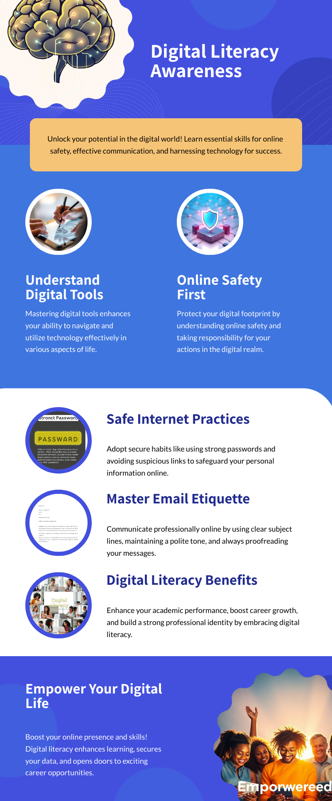
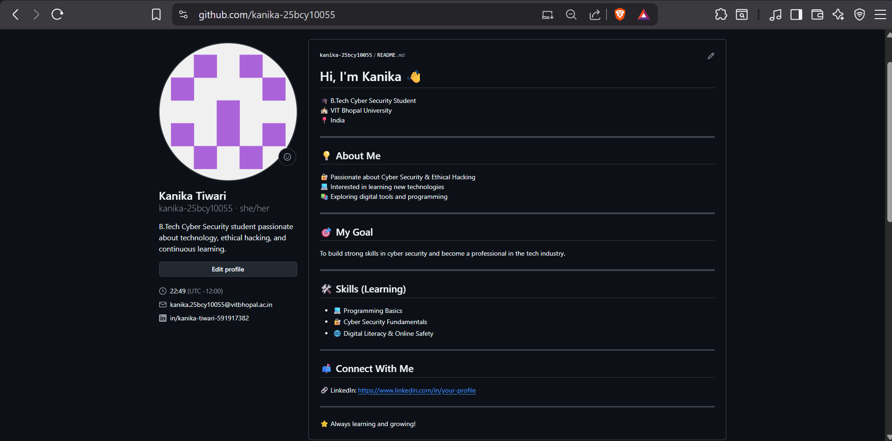
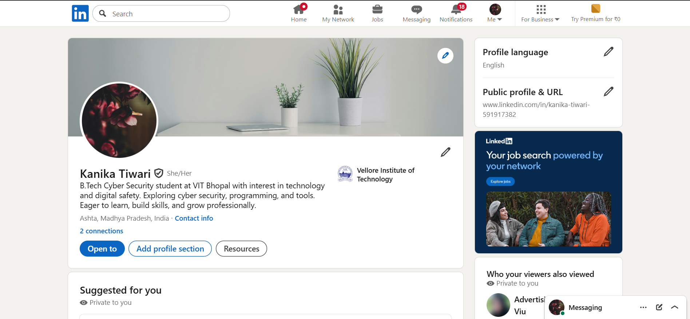
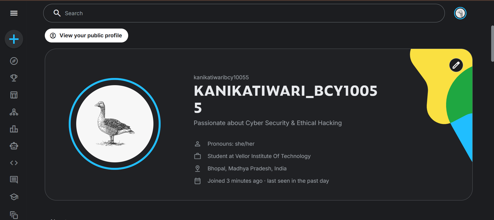

# 📚 Digital Literacy Portfolio

### CSE0001 – Digital Literacy Project

**VIT Bhopal University**

---

## 👨‍🎓 Student Information

| Field                   | Details                                 |
| ----------------------- | --------------------------------------- |
| **Name**                | Kanika Tiwari                           |
| **Registration Number** | 23BCE00055                              |
| **Branch**              | B.Tech – Computer Science & Engineering |
| **Year**                | 1st Year                                |
| **Course Code**         | CSE0001                                 |
| **Course Title**        | Digital Literacy                        |
| **University**          | VIT Bhopal University                   |
| **Project Type**        | Individual Portfolio Project            |

---

## 🌐 Project Overview

This repository contains my **Digital Literacy Portfolio**, developed as part of **CSE0001 – Digital Literacy** at VIT Bhopal University.

In this project, I acted as a **Student Digital Ambassador**, aiming to help peers navigate the digital world effectively. The project covers:

* Digital communication and **email etiquette**
* Building a **professional online identity**
* Using **coding and collaboration platforms**
* Understanding and preventing **cybercrime**
* Promoting **responsible social media use**

---

## 📂 Repository Structure
digital-literacy-project
│
├── README.md
├── report/
│ └── Project_Report.pdf
├── task-1-presentation/
│ └── infographic.png
├── task-2-portfolio/
│ ├── github-profile.png
│ ├── linkedin-profile.png
│ └── kaggle-profile.png
├── task-3-platforms/
│ ├── coding-challenge.png
│ ├── google-form.png
│ └── google-form-responses.png
├── task-4-email-etiquette/
│ ├── email-extension-request.txt
│ ├── internship-email.txt
│ └── social-media-checklist.md
└── task-5-cybercrime/
├── casestudy.md
└── prevention-checklist.md

---

# 🧩 Project Tasks

The portfolio includes **five main tasks**, each building an essential skill in **digital literacy**:

1. **Digital Literacy Awareness Infographic**  
2. **Student Digital Portfolio**  
3. **Coding & Collaboration Platforms**  
4. **Professional Email & Digital Etiquette**  
5. **Cybercrime Awareness Case Study**

---

## 📊 Task 1 – Digital Literacy Awareness Infographic

📁 File: `task-01/`

**Objective:** Create a one-page infographic explaining **digital literacy** and its importance.  

**Tool Used:** Canva

**Topics Covered:**

* Definition of digital literacy  
* Safe internet practices  
* Professional online presence  
* Email etiquette  
* Useful digital tools for students  

**Outcome:** A visual, simple, and engaging infographic to **promote responsible digital behavior**.

**Infographic Preview:**

> The infographic visually summarizes key digital literacy concepts for easy understanding.

---

## 👨‍💻 Task 2 – Student Digital Portfolio

📁 Folder: `task-2-portfolio/`

**Objective:** Build a professional digital identity using developer and professional platforms.

**Platforms Created:**

| Platform     | Purpose                                                    |
| ------------ | ---------------------------------------------------------- |
| **GitHub**   | Hosting projects and version control                       |
| **LinkedIn** | Professional networking and career opportunities           |
| **Kaggle**   | Data science learning and competitions                     |

**Activities Completed:**

* Created GitHub, LinkedIn, and Kaggle accounts  
* Uploaded screenshots of profiles  
* Developed a plan to maintain a **long-term digital portfolio**  

**Platform Previews:**

GitHub:  
  

LinkedIn:  
  

Kaggle:  
  

> These platforms showcase my **projects, skills, and professional presence**.

---

## ⚙️ Task 3 – Coding & Collaboration Platforms

📁 Folder: `task-3-platforms/`

### Part A – Coding Practice

**Platform:** HackerRank  
**Challenge Completed:** Solve Me First  

**Learning Outcomes:**

* Practiced programming problems online  
* Learned automated code evaluation  
* Improved problem-solving skills  

**Screenshot:**  

---

### Part B – Google Workspace Collaboration

**Activity:** Created a **Digital Literacy Awareness Quiz** using Google Forms  

* Total Questions: 5  
* Question Types: Multiple Choice, Short Answer  

**Google Form Preview:**  
  

**Purpose:** Assess students’ knowledge of **digital literacy concepts**.

---

## 📧 Task 4 – Professional Email & Digital Etiquette

📁 Folder: `task-4-email-etiquette/`

### Email 1 – Assignment Extension Request

* Clear subject line  
* Polite and formal request  
* Professional closing and signature  

### Email 2 – Internship Inquiry

* Introduced myself professionally  
* Expressed interest in internship  
* Shared academic background  
* Proper sign-off  

### Social Media Do’s & Don’ts

**Do’s:**

* Maintain professional online presence  
* Verify information before sharing  
* Protect personal data  
* Communicate respectfully  
* Follow digital ethics  

**Don'ts:**

* Share sensitive information  
* Post offensive content  
* Spread misinformation  
* Engage in cyberbullying  
* Violate others’ privacy  

> Promotes **responsible and professional digital communication**.

---

## 🔐 Task 5 – Cybercrime Awareness Case Study

📁 Folder: `task-5-cybercrime/`  

**Cybercrime Selected:** Phishing Attack  

**Summary:** Attackers attempt to trick users into sharing **confidential information** via fake emails or websites.

**Consequences:** Financial loss, identity theft, account compromise, privacy violations  

**Prevention Checklist:**

1. Never share OTPs or passwords  
2. Verify suspicious emails/messages  
3. Avoid unknown links  
4. Enable **two-factor authentication (2FA)**  
5. Use strong, unique passwords  
6. Monitor bank/UPI transactions  
7. Avoid scanning unknown QR codes  
8. Keep devices updated  

**Reporting in India:**  

* [National Cyber Crime Portal](https://cybercrime.gov.in)  
* Helpline: 1930  

---

## 📑 Project Report

📁 Folder: `report/`  

The report includes:

* Introduction & objectives  
* Task explanations with screenshots  
* Reflections & learning outcomes  
* References & resources  

---

## 🎯 Key Learning Outcomes

* Responsible digital usage  
* Professional online identity creation  
* Coding & collaboration skills  
* Professional email communication  
* Cybersecurity awareness  

---

## 📚 References

* [GitHub](https://github.com)  
* [LinkedIn](https://linkedin.com)  
* [Kaggle](https://kaggle.com)  
* [HackerRank](https://hackerrank.com)  
* [Google Forms](https://forms.google.com)  
* [National Cyber Crime Portal](https://cybercrime.gov.in)  

---

## ⭐ Conclusion

This project enhanced my **digital awareness, communication skills, and cybersecurity knowledge**.  
It demonstrates my ability to maintain a **professional digital presence** and safely navigate the online world.

---
